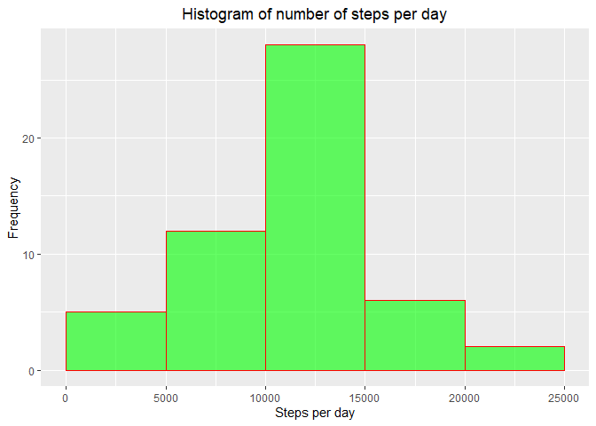
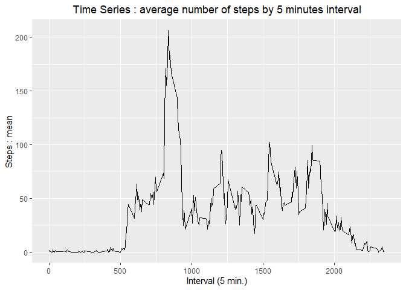
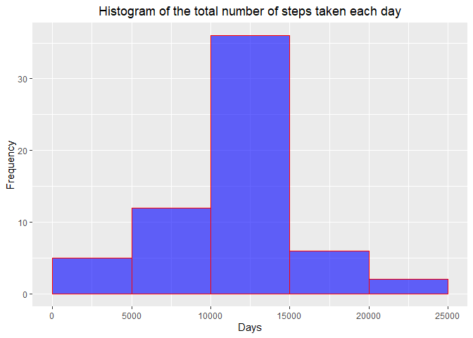
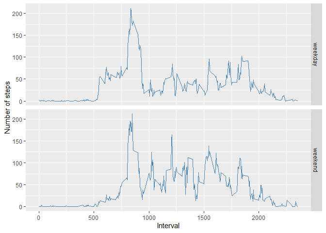

## Loading and preprocessing the data
### Load the data, process/transform

```r
library(dplyr)
library(ggplot2)
library(lubridate)
```


```r
actDf <- read.csv(unz("activity.zip", "activity.csv"), stringsAsFactors = F)

head(actDf)
```

```
##   steps       date interval
## 1    NA 2012-10-01        0
## 2    NA 2012-10-01        5
## 3    NA 2012-10-01       10
## 4    NA 2012-10-01       15
## 5    NA 2012-10-01       20
## 6    NA 2012-10-01       25
```


## What is mean total number of steps taken per day?
### Calculate the total number of steps taken per day

```r
stepDay <- actDf %>%
        group_by(date) %>%
        na.omit() %>%
        summarize(stepsPerDay = sum(steps))

head(stepDay)
```

```
## # A tibble: 6 x 2
##   date       stepsPerDay
##   <chr>            <int>
## 1 2012-10-02         126
## 2 2012-10-03       11352
## 3 2012-10-04       12116
## 4 2012-10-05       13294
## 5 2012-10-06       15420
## 6 2012-10-07       11015
```

### Make a histogram of the total number of steps taken each day

```r
ggplot(stepDay, aes(stepsPerDay)) +
        geom_histogram(breaks=seq(0, 25000, by = 5000), 
                       col="red", 
                       fill="green", 
                       alpha = 0.6) +
        labs(x="Steps per day", y="Frequency" ) +
        ggtitle("Histogram of number of steps per day") +
        theme(plot.title = element_text(hjust = 0.5))
```

<!-- -->

### Calculate and report the mean and median

The mean of the total number of steps per day is: 

```r
mean(stepDay$stepsPerDay)
```

```
## [1] 10766.19
```

The median of the total number of steps per day is: 

```r
median(stepDay$stepsPerDay)
```

```
## [1] 10765
```


## What is the average daily activity pattern?
### Make a time series plot

```r
stepIntAv <- actDf %>%
        group_by(interval) %>%
        na.omit() %>%
        summarize(stepsAvPerInt = mean(steps))

ggplot(stepIntAv, aes(x = interval, y = stepsAvPerInt)) +
        ggtitle("Time Series : average number of steps by 5 minutes interval") +
        theme(plot.title = element_text(hjust = 0.5)) +
        geom_line() +
        xlab("Interval (5 min.)") +
        ylab("Steps : mean")
```

<!-- -->

### Which 5 minutes interval has the maximum number of steps

Maximum average number of steps per 5 minutes interval:

```r
stepIntAv %>% filter(stepsAvPerInt == max(stepsAvPerInt))
```

```
## # A tibble: 1 x 2
##   interval stepsAvPerInt
##      <int>         <dbl>
## 1      835          206.
```


## Imputing missing values
### Calculate and report the total number of missing values in the dataset
Check the missing values in every column and sum it:

```r
naColVect <- colnames(actDf)[apply(actDf, 2, anyNA)]
naColVect
```

```
## [1] "steps"
```

```r
sum(is.na(actDf$steps))
```

```
## [1] 2304
```

### Devise a strategy for filling in all of the missing values in the dataset.
The strategy chosen is to replace NA with the mean for that 5 minute interval. 

* Merging of the original dataset with the interval data set:

```r
actDf2 <- merge(actDf, stepIntAv, by.x="interval", by.y="interval", all=TRUE)
```

### Create a new dataset with missing data filled in
* Creating one new dataset with steps NA replaced by 5 minute interval average value

```r
actDf2NoNa <- actDf2 %>%
        mutate(stepsNoNa = coalesce(as.double(steps), stepsAvPerInt))
sum(is.na(actDf2NoNa$steps)); sum(is.na(actDf2NoNa$stepsNoNa))
```

```
## [1] 2304
```

```
## [1] 0
```

```r
head(actDf2NoNa)
```

```
##   interval steps       date stepsAvPerInt stepsNoNa
## 1        0    NA 2012-10-01      1.716981  1.716981
## 2        0     0 2012-11-23      1.716981  0.000000
## 3        0     0 2012-10-28      1.716981  0.000000
## 4        0     0 2012-11-06      1.716981  0.000000
## 5        0     0 2012-11-24      1.716981  0.000000
## 6        0     0 2012-11-15      1.716981  0.000000
```

* Checking the whole

```r
checkTailNa <- actDf2NoNa %>%
        arrange(stepsNoNa)
```


```r
tail(checkTailNa)
```

```
##       interval steps       date stepsAvPerInt stepsNoNa
## 17563     1635   785 2012-11-18      38.56604       785
## 17564      835   786 2012-10-15     206.16981       786
## 17565      720   789 2012-11-19      49.92453       789
## 17566      550   794 2012-11-27      39.45283       794
## 17567      900   802 2012-10-12     143.45283       802
## 17568      615   806 2012-11-27      63.45283       806
```

### Make a histogram of total number of steps taken each day

* Group by variable of interest:

```r
stepDay2 <- actDf2NoNa %>%
  group_by(date) %>%
  summarize(stepsPerDay2 = sum(stepsNoNa))

head(stepDay2)
```

```
## # A tibble: 6 x 2
##   date       stepsPerDay2
##   <chr>             <dbl>
## 1 2012-10-01       10766.
## 2 2012-10-02         126 
## 3 2012-10-03       11352 
## 4 2012-10-04       12116 
## 5 2012-10-05       13294 
## 6 2012-10-06       15420
```

* Make histogram:

```r
ggplot(stepDay2, aes(stepsPerDay2)) +
        ggtitle("Histogram of the total number of steps taken each day") +
        theme(plot.title = element_text(hjust = 0.5)) +
        geom_histogram(breaks=seq(0, 25000, by=5000),
                       col="red",fill="blue", alpha=0.6) +
        xlab("Days") +
        ylab("Frequency")
```

<!-- -->

* Make a table with both total number of steps/day without and with NAs:

```r
stepDay3 <- actDf2NoNa %>%
        group_by(date) %>%
        summarize(stepsNoNa = sum(stepsNoNa), stepsWithNa = sum(steps))

head(stepDay3)
```

```
## # A tibble: 6 x 3
##   date       stepsNoNa stepsWithNa
##   <chr>          <dbl>       <int>
## 1 2012-10-01    10766.          NA
## 2 2012-10-02      126          126
## 3 2012-10-03    11352        11352
## 4 2012-10-04    12116        12116
## 5 2012-10-05    13294        13294
## 6 2012-10-06    15420        15420
```

  
* Calculate the mean of the total number of steps per day without and with missing values :

```r
mean(stepDay3$stepsNoNa); mean(stepDay3$stepsWithNa, na.rm=T)
```

```
## [1] 10766.19
```

```
## [1] 10766.19
```

* Calculate the median of the total number of steps per day without and with missing values :

```r
median(stepDay3$stepsNoNa); median(stepDay3$stepsWithNa, na.rm = T)
```

```
## [1] 10766.19
```

```
## [1] 10765
```

**Conclusion:** The estimation of the impact of imputing missing data on the estimates is that there are no difference in this case regarding the means, but a slight difference regarding the medians.

## Are there differences in activity patterns between weekdays and weekends?

* Create a table

```r
stepWeek <- actDf2NoNa %>%
        mutate(weekDays = ymd(date)) %>%
        mutate(weekDays = wday(weekDays)) %>%
        mutate(weekDayFact = ifelse(weekDays == 6 | weekDays == 1 , "weekend", "weekday")) %>%
        group_by(interval, weekDayFact) %>%
        summarize(stepsNoNaMean = mean(stepsNoNa))

head(stepWeek)
```

```
## # A tibble: 6 x 3
## # Groups:   interval [3]
##   interval weekDayFact stepsNoNaMean
##      <int> <chr>               <dbl>
## 1        0 weekday            2.26  
## 2        0 weekend            0.303 
## 3        5 weekday            0.448 
## 4        5 weekend            0.0599
## 5       10 weekday            0.174 
## 6       10 weekend            0.0233
```

* Make a pannel plot

```r
ggplot(stepWeek, aes(x=interval, y=stepsNoNaMean)) +
        geom_line(color =  "steelblue") +
        facet_grid(weekDayFact ~ .) +
        xlab("Interval") +
        ylab("Number of steps")
```

<!-- -->


